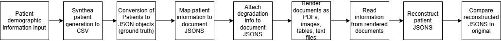
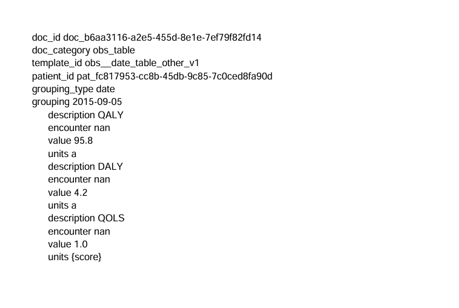
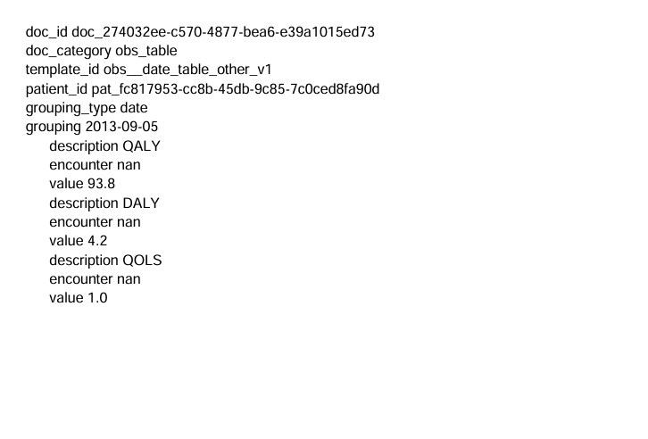

# Synth-EHR

## Purpose
Synth-EHR is a synthetic healthcare document platform for generating fragmented patient records and implementing and evaluating AI tools and workflows. Patient data is distributed across realistic documents (PDFs, images, tables, and text records) in a simulated electronic health record and degraded to simulate real-world conditions. This synthetic data is intended to be deployed in medical contexts for the purpose of evaluating AI tools in a secure environment without providing AI with access to actual patient records. Patient records and documents are also stored as plain text ground truths to facilitate metric analysis of the efficacy of AI tools.

## Motivation
Modern AI tools show great promise in enhancing medical workflows by unifying fragmented patient data into coherent medical records. Deploying AI tools in a medical context, however, requires an exhaustive evaluation of the tool's risks of hallucination, compliance violation, and data leakage. Such an evaluation is uniquely challenging in the medical field. Assessing an AI tool's accuracy requires a dataset that is deeply fragmented (discharge summaries, insurance documents, lab resullts) but also accessible and with an objective gorund truth. Furthermore, this data must be contained in a secure environment where compliance and data-privacy issues can be observed with limited risk. 

There are tools available that assist in generating quality synthetic patient data, but this data is typically output directly to CSVs, spreadsheets, and database maangement systems, and thus does not accurately recreate the context that most patient data actually exists in; fragmented collections of images, tables, and PDFs scattered across files. This tool seeks to build on an existing patient data generation tool (Synthea) by outputing the generated data in a format that matches real-world medical systems.

## Features
-Generation of patient data via Synthea
-Creation of ground truth databases for patient health records, and generated documents
-Output of patient health records to procedurally-generated PDFs, images, tables, and text documents.
-Random degradation of generated documents via effects such as blur, image downsampling, typos, information ommission and more*
-OCR/AI pipeline for recreating patient health records from generated documents
-Dashboard for assessing data generation, and data recreation speed and accuracy


## Current Architecture



## Patient, document, and log structure
For a more detailed look, please go to schemas folder.

### Patient
Each patient will consist of various entities (e.g. allergies, conditions, medications), and each entity will consist of fields (e.g. date started/observed, name, units). 
These fields and entities are what get mapped to rendered documents.
```json
{
"patient": {
    "id": "string",
    "firstName": "string",
    "lastName": "string",
    "dob": "YYYY-MM-DD",
    "gender": "string",
    "entities": []
},
"allergies": [
],
"careplans": [
],
"devices": [
],
"encounters":[
],
"imaging_studies":[
],
"conditions": [
],
"immunizations":[
],
"medications":[
],
"procedures":[
],
"observations":[
]
}
```
### Document
Each document receives patient entities and fields based on the type of document being rendered.
```json
{
  "doc_id": "string",
  "doc_category": "string",
  "template_id": "string",
  "patient_id": "string",
  "date": "YYYY-MM-DD",

  "entities_provided": {
    "<entity_type>": [
      {
        "entity_id": "string",
        "fields": ["string", "..."]
      }
    ]
  }
}
```
### Patient -> Documents Mappings
Mappings track what entities and fields were received by documents (expected), what fields were actually rendered (realized), and what fields were omitted (to simulate mistakes in record keeping)
```json
{
  "log_id": "log_4b59f091-595e-4bf6-a490-a37557c0ce90",
  "patient_id": "pat_fc817953-cc8b-45db-9c85-7c0ced8fa90d",
  "doc_id": "doc_fc156d69-d41f-4747-beea-0c7d9c6c8c82",
  "doc_category": "obs_table",
  "template_id": "obs_date_body_measurements_v1",
  "expected_entities": [
    "obs_2dc14d6e-5305-11f1-a6a5-00155d35d14f",
    "obs_2dc14d96-5305-11f1-a6a5-00155d35d14f",
    "obs_2dc14da0-5305-11f1-a6a5-00155d35d14f"
  ],
  "realized_entities": [
    "obs_2dc14d6e-5305-11f1-a6a5-00155d35d14f",
    "obs_2dc14d96-5305-11f1-a6a5-00155d35d14f",
    "obs_2dc14da0-5305-11f1-a6a5-00155d35d14f"
  ],
  "omitted_entities": "none",
  "field_expectations": {
    "observations": {
      "obs_2dc14d6e-5305-11f1-a6a5-00155d35d14f": {
        "expected_fields": [
          "description",
          "encounter",
          "value",
          "units"
        ],
        "realized_fields": [
          "description",
          "encounter",
          "value"
        ],
        "omitted_fields": ["units"],
        "omission_mode": "FORGOT_UNITS"
      }
    }
  },
  "omitting_mode": "FORGOT_UNITS",
  "degredations": ["blur"]
}
```

### Example degraded documents
The following image pair shows an observations document with and without degradations. In this case, the degradation is the ommission of units for each measurement



### Current status
Developed pipeline that creates patient JSONs, creates documents that contain body measurement information, reads these documents to text via OCR, and measures OCR accuracy

### Future steps
Create GUI that allows users to easily set population parameters for generated patients
Develop more document templates
Convert JSON structure to simulated electronic health record structure
Implement AI tool for reconstructing patient records from documents
Dashboard for viewing patient summary data and AI tool performance