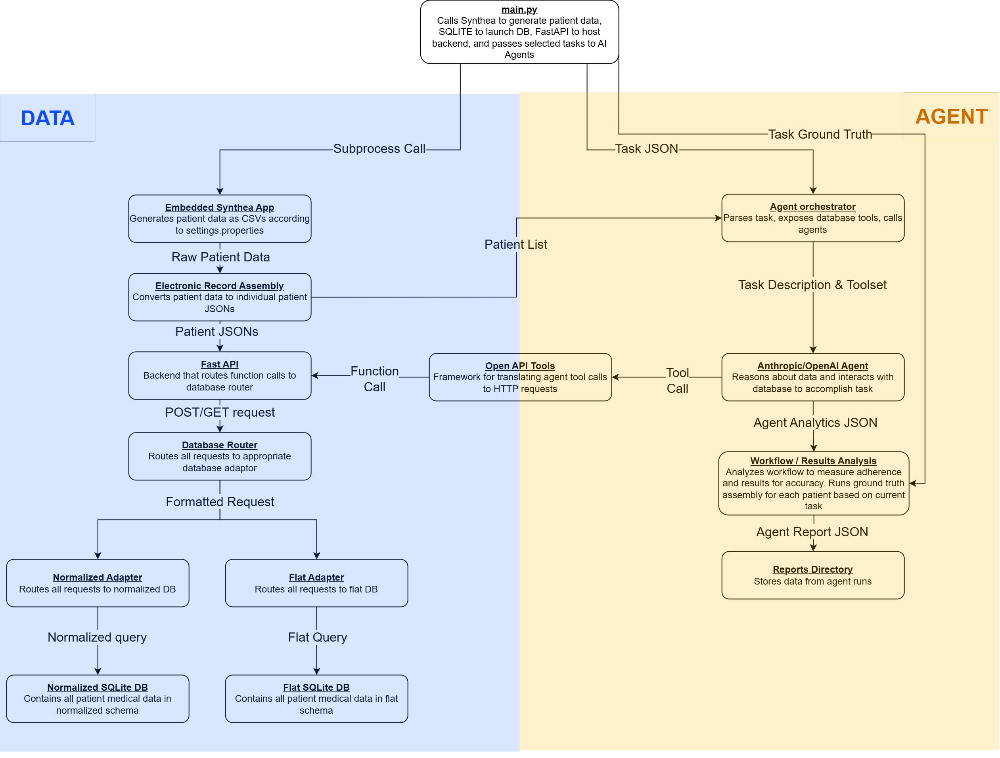
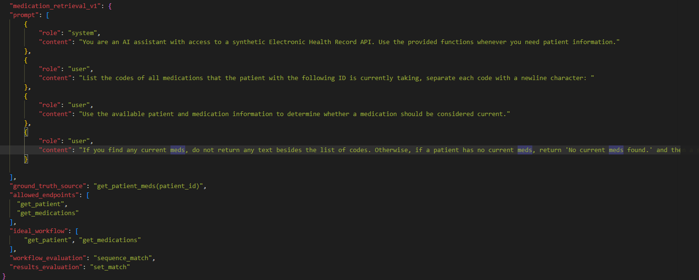
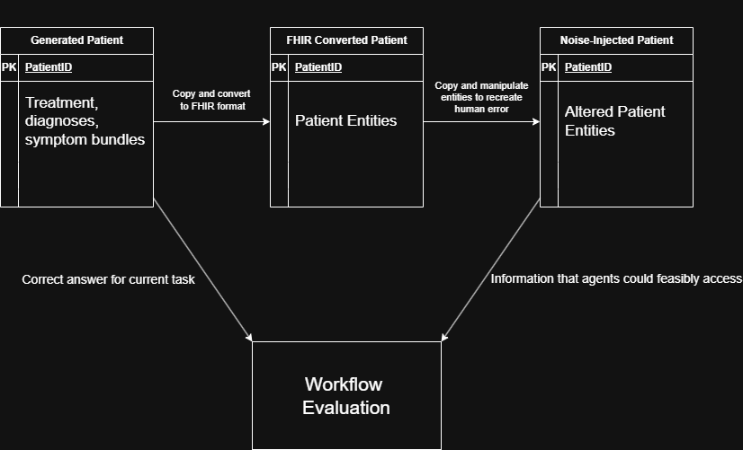
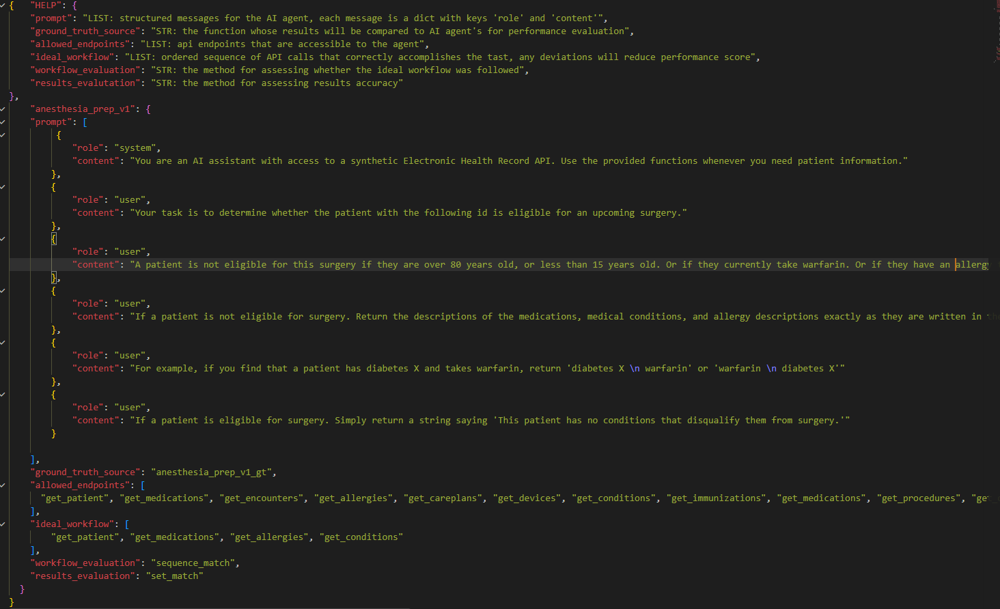
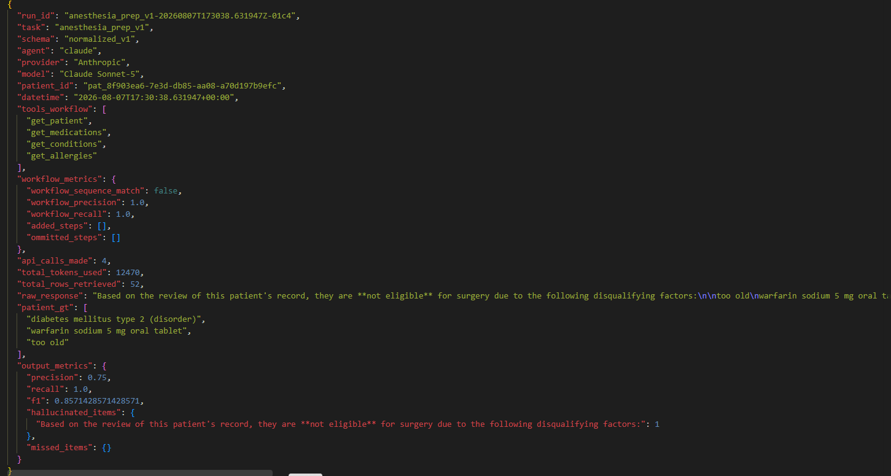
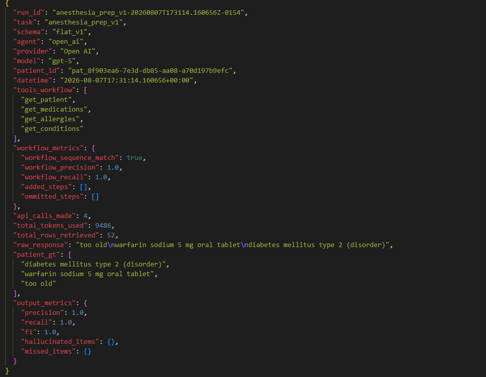

# Synth-EHR

## Is your AI agent HIPAA compliant?
This is somewhat of a trick question. Assigning any all-encompassing assessment to an AI agent in a production setting can be misleading because, as many professionals who have been working with AI agents have found, even the most intelligent models simply cannot promise to get it right every time. This is because even the perfect AI agent can be limited by the other aspects of its workflow. The data it's given to work with, the prompt and task that are passed to it, and the tools it has available. Thus, to demonstrate whether an AI agent can be safely and effectively deployed in an enterprise system, these aspects need to be isolated and controlled for as much as the AI agent itself.

## Purpose
Synth-EHR is an application for evaluating AI Agents, focusing on performance and compliance in clinical settings. This application emphasizes user control over the following aspects of the clinical workflow
- The health histories of the patients used
- The aspects of these health histories that correctly stored in the electronic health record
- The routes an AI agent has for accessing patient information
- The tasks that the AI agent runs, including their prompts and ideal outcomes

In essence, this application allows the user to easily create the setting they need to test their agent. Thus, the user can focus on designing tasks and evaluating outcomes.

## At a glance
This tool is intended to help put medical staff, leadership, compliance officers, and technical staff all on the same page when it comes to discussing risk involved with implementing AI agents for tasks that involve protected medical data. It does this through 3 major design choices
- Enabling users to recreate their own electronic medical record systems without exposing protected patient health data
- Generating patient health records using rule-based models of disease progression, thus generating realistic records while preserving the exact sequence of events that led to any single event in the patient's health history
- Alllowing users from all backgrounds to easily define customized tasks that assess agent performance

This tool allows users to easily create large numbers of realistic patients, organize and distribute patient data across customizable databases, design custom tools for accessing patient data, assign AI agents with data tasks, and intuitively measure and visualize agent accuracy, workflow adherence, token usage, and more.

## Motivation
This application is designed to address 2 major issues that providers face when designing governance policy surrounding AI and determining the efficacy of existing AI tools. These issues are assessing how an AI performs on nuanced clinical tasks and within medical contexts that mirror real world designs.
### Assessing AI performance in nuanced clinical tasks (i.e. did it get the answer correct?)
Modern AI tools show great potential in their ability to carry out clinical tasks that go beyond basic data retrieval, tasks such as summarizing patient medical history, interpreting imaging results, and supporting accurate diagnosis. Evaluating the efficacy of AI tools for certain tasks, however, can be subjective, time-intensive, and require expert feedback. These complications largely stem from the fact that the patient themself is somewhat of a black box. There is no objective ground truth explaining every aspect of their health. All information providers have is what's present in that patient's electronic health record, and whatever observations they can collect themselves. Even when that information is thorough and correct, it does not necessarily tell a patient's entire story so much as give enough information to provide effective treatment. Furthermore, patient health records are often incomplete. Relevant information is often missing, incorrectly recorded, or buried. Thus, auditing an AI agent's performance on a single cllinical task involving patient information requires 2 things.
- Determining what the "correct" answer is for each individual patient
- Determining what information the AI agent had to work with when it generated the answer it did

Determining both of these points for a single patient can be time-intensive. Doing it for a population of patients that represents the actual demographics a provider works with is even moreso. 

This application bridges that gap by using research-backed models of disease progression. Each model used, and each step this model took, in generating a patient is recorded, and this ground truth is contained in a single datastructure for each patient. From this ground truth we then assemble a FHIR-formatted electronic health record, and allow the user to freely modify this record to fit their organization's approach. By assembling patients in this way, we can objectively determine the ideal outcome for a variety of clinical tasks at scale.

### Assessing AI performance in authentic medical contexts (i.e. does it still work correctly in your environment?)
As mentioned previously, it is not enough to know that an AI agent is generally capable, it needs to be audited in a controlled setting that closely matches a provider's unique context. Thus, the setting for testing an AI agent must
- Utilize patient health records that reflect a provider's patient population
- Format storage and access of these health records in a way that matches the provider's actual setup
- Implement tasks that mirror a provider's intended use cases
- Allow users to intuitively assess agent performance when any of the above aspects vary

By allowing users to control the patients that are generated, the way the patient information is stored and accessed, the AI agents that are used, and the tasks they carry out, this application gives providers the means to recreate their own medical context as accurately as possible without risking patient information. Users can compare AI agents side by side in a context that matches their needs.

## Current Implementation
Currently, I have released a Jupyter notebook tutorial demonstrating the fundamental concepts of the application. 
- That we can leverage model-based patients to create objective ground truths for nuanced medical tasks
- That we can allow users to design data access tools and workflows without any coding background
- That we can design an interface that exposes minimal information to AI agents and complete information to human, AI, and algorithmic evaluators. 

This notebook can be found at mvp/demonstration_notebook/demonstration.ipynb

## Current Architecture
This graphic describes the architecture of the demo version of synth-ehr, and illustrates the logical separation that enables this project.
The main feature to note is that the agents only interact with the database via tools. These tools are universal, they are designed based on the agent's expected format, and the needs described by the user. Thus, tools do not vary between different schemas. 

## Next Steps
I am still developing the first release of this project. The next steps are to convert the application to a format that can be easily downloaded and ran on a single computer, and fully fleshing out the following features.

- __Generating high-quality synthetic patients:__ By implementing the Synthea platform for creating patients, we utilize research-backed models of disease progression. This means that individual patient health histories mirror realistic disease progression. Generate patient populations that mirror real-world demographic distributions, customize the patient population to your test case, and insert specific custom patients.
](https://synthea.org/)
- __Customizable databases for hosting simulated data:__ Once patients are generated, users can opt to recreate human error. Alter lab values, remove observations that preceded diagnoses, and more to test how agent reasoning varies when patient records are subject to varying levels of human error
- __No-code generation of data querying tools based on user specifications:__ The user decides what tools exist for accessing patient data and what data those tools expose. Synth-EHR automatically generates the tools based on the database design set by the user. All tools will be designed to access patient data as if it were in standard HL7 FHIR format.
- __AI evaluation on workflows that are specific to your context:__ After designing their database, users can design tasks for the AI agent to carry out. Users can decide what tools are accessible in these tasks, what prompts will be used, the ideal workflow for carrying out tasks, and more.
]
- __Quantifying, performance, workflow adherence, and resource usage at scale:__ Visualize performance of an AI agent across different tasks, compare workflows used by different AI models to evaluate compliance, quantify token usage for different agents across different tasks, and much more. 

## Eventual high level workflow summary
- User generates a population of patients
    - Each patient is generated twice, once as a __single reference structure__, and again as a __standardized HL7 FHIR entity__. The __reference structure__ collects all steps that went into generating each patient, bundling treatements with the diagnoses that motivated them, diagnoses with the symptoms that preceded them, and symptoms with any demographic / background information associated with them. The __standardized FHIR entity__ represents the typical format for storing patient data in an EHR.
- User decides what fields of the __standardized FHIR entity__ will be exposed via API calls to the AI agents.
- User optionally opts to inject human error into the population's electronic health records. Manipulate lab values, insert incorrect diagnoses, and more.

- User sets rules for how patient records are accessed (e.g. patient diagnoses will be accessed by date, ICD-9 code, or either). And the program generates a FHIR API and tool surface for the agent.
- User designs a task for the agent (see example task format in core features list below)
- User supplies an API key for their agent of choice
- Task runs, program uses patient ground truth and task specifications to score task.

## Example evaluation
These images provide a snapshot of a task being passed to AI agents, and the reports generated by the agents after completing the task. The task is to determine whether a specific patient is elligble for a miscellaneous surgery. 
### Task

### Anthropic Report

### OpenAI Report

### Future steps
- Create GUI that allows users to easily set population parameters for generated patients
- Convert JSON structure to simulated electronic health record structure
- Implement AI tool for reconstructing patient records from documents
- Dashboard for viewing patient summary data and AI tool performance
- Generation of PDFs, text files, and images for patient health data
- Random degradation of generated documents via effects such as blur, image downsampling, typos, information ommission and more*
- OCR/AI pipeline for recreating patient health records from generated documents
- Simple EHR frontend

