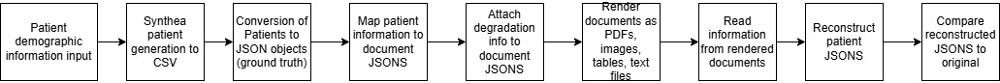

# Synth-EHR

## Purpose
Synth-EHR is an application for evaluating AI Agents in a clinical setting, assessing accuracy and performance of the agents as well as the degree to which an agent's workflow follows HIPPA compliance and in-house rules of individual healthcare providers. Assess AI agents on your system, at scale, without exposing protected information. 

## At a glance
This tool allows users to easily create large numbers of realistic patients, organize and distribute patient data across customizable databases, design custom tools for accessing patient data, assign AI agents with data tasks, and intuitively measure and visualize agent accuracy, workflow adherence, token usage, and more.

## Motivation
This application is designed to address 2 major issues that providers face when designing governance policy surrounding AI and determining the efficacy of existing AI tools. These issues are assessing how an AI performs on nuanced clinical tasks and within medical contexts that mirror real world designs.
### Assessing AI performance in nuanced clinical tasks
Modern AI tools show great potential in their ability to carry out clinical tasks that go beyond basic data retrieval, tasks such as summarizing patient medical history, interpreting imaging results, and supporting accurate diagnosis. Evaluating the efficacy of AI tools for certain tasks, however, can be subjective, time-intensive, and require expert feedback. These complications largely stem from the fact that patient health records are dynamic, ever-growing entities. New information is being added to these records all the time, and determining the relevance of any specific information to the current clinical task often requires expert domain knowledge and a firm grasp of a patient's medical history.
This application bridges that gap by using research-backed models of disease progression. In essence, patients are generated from the ground up. The exact conditions that a patient presents with at any time are known, as well as the exact time sequence of symtpoms that proceeded that condition, and this ground truth is contained in a single datastructure for each patient. By assembling patients in this way, we can objectively determine the ideal outcome for a variety of clinical tasks at scale and without needing human intervention.
### Assessing AI performance in authentic medical contexts
There is no shortage of AI tools that demonstrate great domain knowledge in the medical field, but leveraging this knowledge requires an agent to consistently navigate a specific medical provider's electronic health record while maintaining the context they've assembled for the current patient. Performance in this domain can vary between agents, tasks, database layouts, and even among specific patient charts. Because of this, providers need a way of determining how an agent performs in a database that matches their own and with patients that mirror their real-world population, and they need an approach that is reproducible, can be performed without significant investment in the wrong AI model, and without exposing protected patient information. 
By allowing users complete control over the patients that are generated, the way these patients are organized within a database, the AI agents that are used, and the tools that are provided to an AI agent for completing tasks, this application gives providers the means to recreate their own medical context as accurately as possible without risking patient information. Users can compare AI agents side by side in a context that matches their needs.

## Core Features
- Generating high-quality synthetic patients: By implementing the Synthea platform for creating patients, we utilize research-backed models of disease progression. This means that generated patient populations accurately recreate real-world populations, and individual patient health histories mirror realistic disease progression. Generate patient populations that mirror real-world demographic distributions, or insert individual patients according to your needs.
- Customizable databases for hosting simulated data: This application supports custom database schema designs. The user decides what data will exist on what tables, what entities should be allowed to access these tables, and what data standards these database adheres to, whether it be FHIR, C-CDA, or something else.
- No-code generation of data querying tools based on user specifications: The user decides what tools exist for accessing patient data and what data those tools expose. Synth-EHR automatically generates the tools based on the database design set by the user.
- Quantitative AI evaluation that is agnostic to database design and specific AI agent being used: this application includes end-to-end implementations for carrying out and evluating AI performance in routine clinical tasks such as patient medical history summaries, collection of relevant conditions, and health diagnoses. Users can create customized tasks for their simulated databases, or edit existing tasks, and the application will pass these workflows on the user's AI agent of choice.
- Quantifying, performance, workflow adherence, and resource usage at scale: Visualize performance of an AI agent across different tasks, compare workflows used by different AI models to evaluate compliance, quantify token usage for different agents across different tasks, and much more. 


<!-- ## Current Architecture

 -->

## Patient, document, and log structure
For a more detailed look, please go to schemas folder.

### Patient
Each patient will consist of various entities (e.g. allergies, conditions, medications), and each entity will consist of fields (e.g. date started/observed, name, units). 
These fields and entities are what get mapped to rendered documents.
```json
{
"patient": {
    "id": "string",
    "firstName": "string",
    "lastName": "string",
    "dob": "YYYY-MM-DD",
    "gender": "string",
    "entities": []
},
"allergies": [
],
"careplans": [
],
"devices": [
],
"encounters":[
],
"imaging_studies":[
],
"conditions": [
],
"immunizations":[
],
"medications":[
],
"procedures":[
],
"observations":[
]
}
```

### Future steps
- Create GUI that allows users to easily set population parameters for generated patients
- Convert JSON structure to simulated electronic health record structure
- Implement AI tool for reconstructing patient records from documents
- Dashboard for viewing patient summary data and AI tool performance
- Generation of PDFs, text files, and images for patient health data
- Random degradation of generated documents via effects such as blur, image downsampling, typos, information ommission and more*
- OCR/AI pipeline for recreating patient health records from generated documents
- Simple EHR frontend

### MVP
- Synthetic patient JSON
- SQLite/Postgres tables
- FastAPI endpoints
- AI agent queries endpoints
- AI outputs reconstructed JSON
- evaluator compares AI JSON vs ground truth
- Streamlit dashboard shows errors

